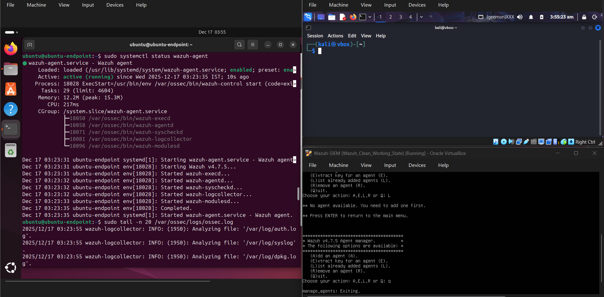
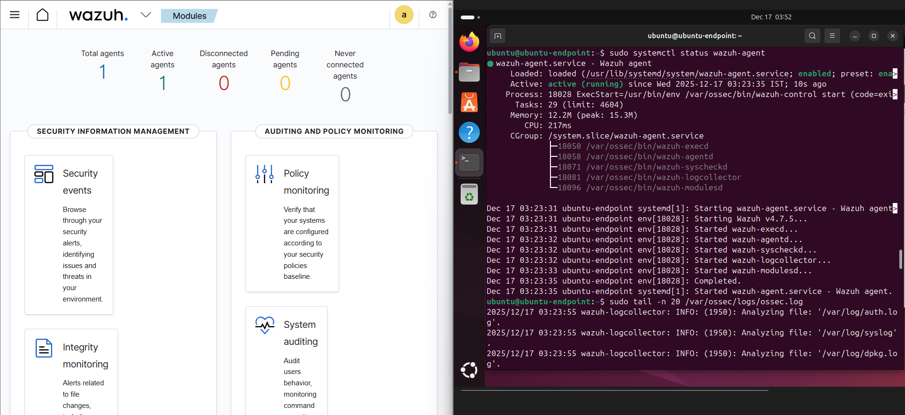
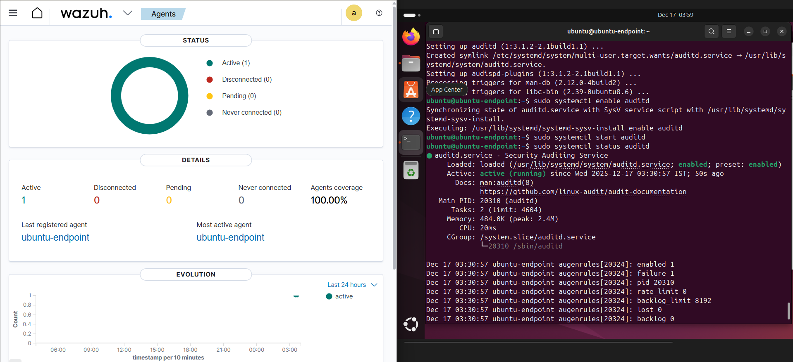
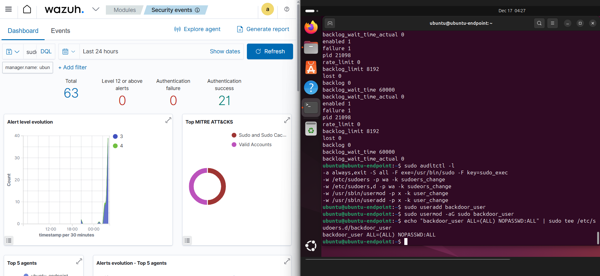

# Privilege Escalation Detection Lab (Wazuh SIEM)

## 📌 Overview
This project demonstrates detection of Linux privilege escalation activities using **Wazuh SIEM**.  
A vulnerable Ubuntu endpoint was monitored using audit rules and Wazuh custom detection logic to identify post-exploitation behaviors such as unauthorized sudo access and account creation.

---

## 🧱 Lab Architecture
- **Wazuh SIEM Manager**
- **Ubuntu Victim Machine (Wazuh Agent Installed)**
- **Kali Linux (Attacker Simulation)**

---

## 🔗 Agent Integration
The Ubuntu endpoint was successfully onboarded to the Wazuh SIEM and actively monitored.

---

## 🔍 Auditd Configuration
Linux auditd was enabled on the victim machine to log security-relevant events.

---

## 🚨 Privilege Escalation Audit Rules
Custom audit rules were deployed to monitor:
- Sudo command execution
- Sudoers file modification
- User and privilege changes

---

## 💥 Privilege Escalation Simulation
Privilege escalation was simulated by creating a backdoor user with passwordless sudo access.

---

## 📊 Detection & Alerts
Wazuh successfully detected the privilege escalation activities and generated security alerts.

---

## 🧠 MITRE ATT&CK Mapping
Detected activities were mapped to MITRE ATT&CK techniques such as:
- **T1136 – Create Account**
- **T1548.003 – Abuse Elevation Control Mechanism**

---

## 🛠 Tools Used
- Wazuh SIEM
- Linux auditd
- Ubuntu 24.04
- VirtualBox

---

## 🎯 Key Learnings
- Endpoint monitoring with SIEM
- Detecting post-exploitation privilege escalation
- Custom audit rule creation
- MITRE ATT&CK–based analysis

---

## 📎 Author
**Syed Akifuddin Arif**  
Cybersecurity | SOC | Blue Team
